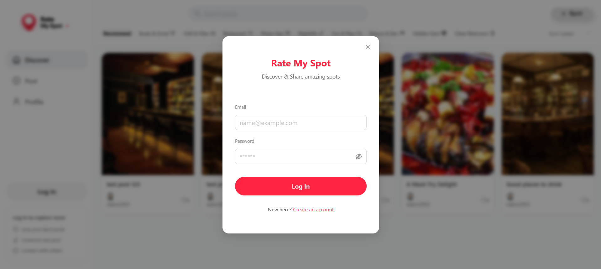
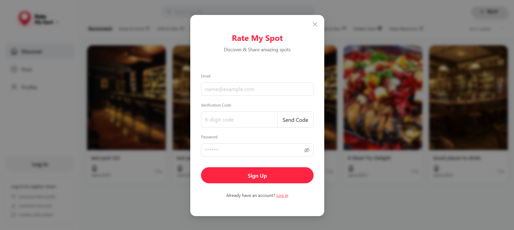
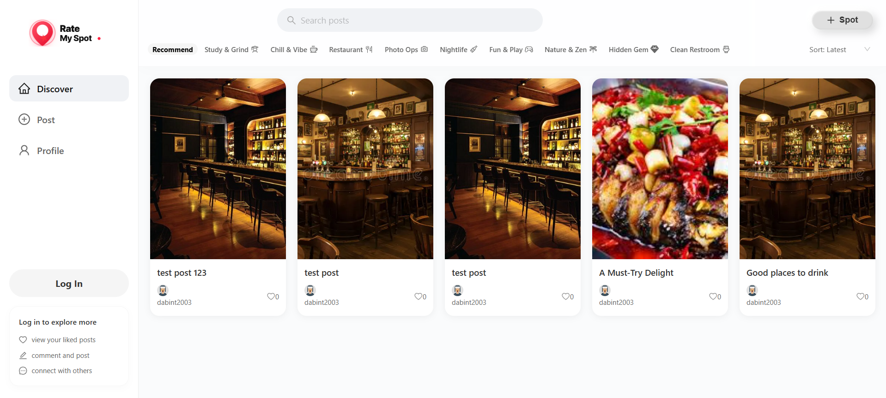
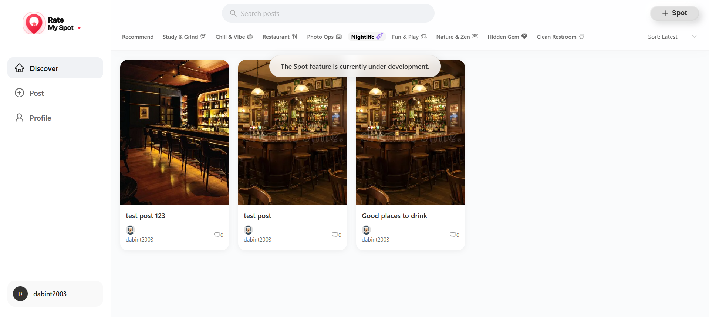
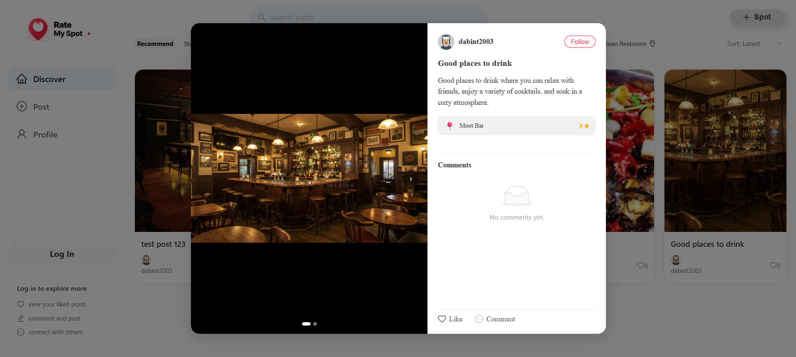
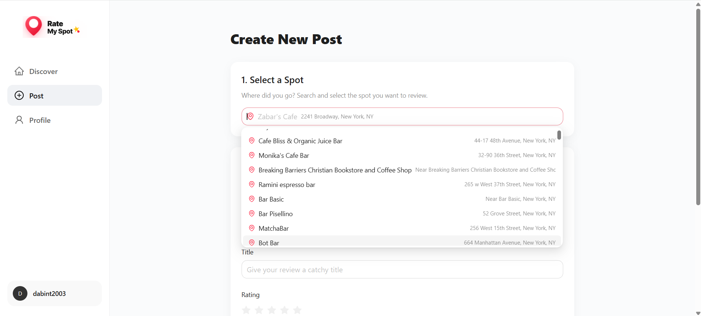
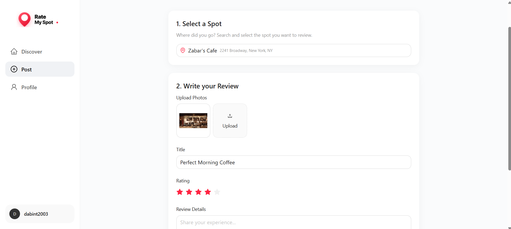
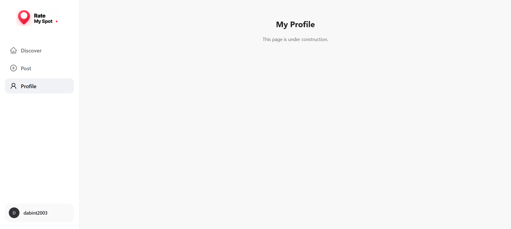

# Rate My Spot
WORKING ON IT....
## Project Overview

**Rate My Spot** is a platform for discovering spots, sharing experiences, and building social connections. It consists of two parts:

1.  **User Client (Major part)**: It will include the following features: user sign-up and login, searching for spots and viewing details, rating and reviewing spots, posting content with photos and text about spots, liking or commenting on posts, friends and following features, and discovering nearby spots, etc.
2.  **Admin Panel (Minor part)**: An admin dashboard that lets administrators manage the platform. They can add or update spot details, delete inappropriate reviews, posts, and comments, and manage user accounts to keep the community following the rules.

---

## Tech Stack

### Frontend
- React + TypeScript
- Vite
- Ant Design
- TanStack Query
- React Router v6
- Axios
- Zustand

### Backend
- Java 19
- Spring Boot 
- Spring Data JPA
- Spring Data Redis
- MySQL 8.0
- Swagger / OpenAPI
- Maven

---
## Screenshots

### 1. User Authentication 
<p align="center">
  
  
</p>

### 2. Discover Feed & Spot
<p align="center">
  
  
</p>

### 3. Post & Creation
<p align="center">
  
  
  
</p>

### 4. User Profile
<p align="center">
  
</p>

---

## Installation & Execution

### Prerequisites
* **Java 19** & **Maven**
* **Node.js (v18+)** & **npm**
* **MySQL 8.0** & **Redis**

### Step 1: Backend Setup
1. **Initialize Database**:
   - Navigate to `backend/src/main/resources/dbt`.
   - Import the SQL files located in this directory to initialize your MySQL database tables.
2. **Configuration**:
   - Open `backend/src/main/resources/application.yml`.
   - Configure your database & redis credentials in `application.yml`.
3. **Run the Application**:
   - Open your terminal in the `backend` folder and execute the command for your OS:
   - **Windows**:
     ```bash
     mvnw.cmd spring-boot:run
     ```
   - **Mac / Linux**:
     ```bash
     chmod +x mvnw
     ./mvnw spring-boot:run
     ```

### Step 2: Frontend Setup
1. Navigate to the `frontend` folder.
2. **Install Dependencies**:
   ```bash
   npm install
   ```
3. **Start the App**:
   ```bash
   npm run dev
   ```

---